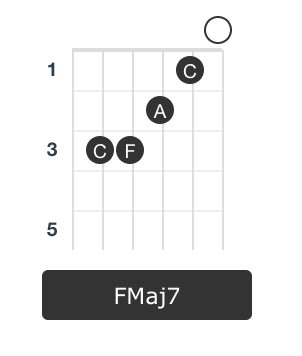

# Documentation

## Table of Contents
1. [Setup](#setup)
	1. [with npm](#with-npm)
	1. [with a \<script\> tag](#with-a-script-tag)
    1. [as an es6 module](#as-an-es6-module)
1. [Introduction](#introduction)
1. [Methods](#methods)
	1. [Instrument](#instrument)
    	1. [getChordInfo](#getchordinfo) 
        1. [getChordLayout](#getchordlayout)
        1. [getChordsList](#getchordslist) <small>**experimental**</small>
	1. [Helpers](#helpers)
    	1. [isValidTab, isValidTuning, isValidChord](#isvalidtab-isvalidtuning-isvalidchord)
        1. [parseTab, parseTuning, parseChord](#parsetab-parsetuning-parsechord)
    	1. [tuning](#tuning)
        1. [notes](#notes)
1. [Supported chords](#supported-chords)

<br />

***

## Setup

You can choose between 3 diffent versions depending on your environment.

### With npm

`npm install -S chordictionary` to install Chordictionary and save it as a dependency in your project.
Then require the module:

```JavaScript
const chordictionary = require('chordictionary');
```

For proper styling of the chords layout, you will need to use the css from the package and copy it to your project.
```shell
cp node_modules/chordictionary/build/chordictionary.min.css ./path_to_your_css_folder
```

#### Exemple integration with Vue.JS
Note that in Vue, css file can be imported like js files. Hence you do not need to copy the file.

```JavaScript
// main.js

import Vue from 'vue'
import App from './App.vue'

import '../node_modules/chordictionary/build/chordictionary.min.css'
import * as chordictionary from 'chordictionary'

Vue.config.productionTip = false

// To make it available throughout all Vue.JS components
Vue.mixin({
	methods: {
		chordictionary: chordictionary
	}
})

new Vue({
	render: h => h(App)
}).$mount('#app')
```

### With a \<script> tag

Go to the [release page](https://github.com/greird/chordictionaryjs/releases/latest) and download the latest Chordictionary file. Unpack it and add `iife/chordictionary.min.js` to your project via a simple `<script>` tag. Add `chordictionary.min.css` for proper chord layout styling.

```HTML
<!DOCTYPE html>
<html>
<head>
  <link type="text/css" rel="stylesheet" href="/chordictionary/chordictionary.min.css">
</head>
<body>
  <script src="/chordictionary/iife/chordictionary.min.js"></script>
</body>
</html>
```

The library is now loaded as `chordictionary`.

### As an ES6 module

Chordictionary is written in ES6. The untranspiled version of the module is available from the [release page](https://github.com/greird/chordictionaryjs/releases/latest). Download the latest Chordictionary file, unpack it and import the `es6/main.js` file to your project.

```JavaScript
import * as chordictionary from './chordictionary/es6/chordictionary/main.js';
```
<br />

***
## Introduction


Some methods are available only when an instrument has been defined.  
You do this by creating a new instance of Instrument.

`var myInstrument = new Instrument (tuning, fretNumber, fretsToDisplay, maxSpan);`

| Param        		| Type		|   		| Description | 
| ------------------|-----------| ----------|-------------|
| `tuning`     		| String	| Required 	|The instrument tuning in standard letter notation (e.g.: "EADGBE")|
| `fretNumber`     	| Int     	| Required 	|The instrument's number of frets.|
| `fretsToDisplay`	| Int     	| Optional	|The number of frets to be displayed on a chord layout. (0 = auto-resize, default 0)|
| `maxSpan`			| Int      	| Optional	|The maximum number of frets that you can cover with your hand. (Default 4)|
<br />

#### Exemple: Defining an electric guitar  

```Javascript
let myInstrument = new chordicationary.Instrument('EADGBE', 24, 7, 4);
```

Here I have defined a guitar in standard tuning (from the lowest to highest string). It has a total of **24 frets**.
I want the graphic representation to display 7 frets.
The maximum number of frets I can cover with my hand is 4. (Chordictionary will take this in consideration when generating chords).

<br />

***
## Methods

### Instrument

The following methods are only available when called on an Instrument instance.
We assume that the following instrument has been defined:

```Javascript
let myInstrument = new chordicationary.Instrument('EADGBE', 24, 7, 4);
```

#### <span style="color:#00458f">getChordInfo</span>

Return every known information about a tab notation, including: the chord name(s), the notes composition and the chord(s) formula.

```myInstrument.getChordInfo(tab)``` 

|Parameter|Type|Description|
|---|---|---|
|`tab` | String | A standard tab notation, as a string with no blank space. Can contains any number or the letter 'x'.|

###### Usage

```javascript
myInstrument.getChordInfo("xx5545");
```
<small>returns</small>
```javascript
{
	error: "",
	chords: [
		{
			name: "Cm6",
			pitch: "C",
			formula: "1-b3-5-6",
			intervals: [null, null, "P5", "P1", "m3", "M6"],
			semitones: [null, null, 7, 0, 3, 9],
			notes: ["x", "x", "G", "C", "D#", "A"],
			quality: "Minor sixth",
			suffix: "m6"
		},
		{
			name: "Am7b5",
			pitch: "A",
			formula: "1-b3-b5-b7",
			intervals: [null, null, "m7", "m3", "A4/d5", "P1"],
			semitones: [null, null, 10, 3, 6, 0],
			notes: ["x", "x", "G", "C", "D#", "A"],
			quality: "Minor seventh, flat fifth",
			suffix: "m7b5"
		}
	],
	notes: ["x", "x", "G", "C", "D#", "A"],
	tab: ["x", "x", "5", "5", "4", "5"],
	tuning: ["E", "A", "D", "G", "B", "E"]
}
```

If something wrong happens, the `error` key won't be empty.

#### <span style="color:#00458f">getChordLayout</span>

Return an html layout for the given tab notation or `False` if it failed.

```myInstrument.getChordLayout(tab, options)```

|Parameter|Type|Description|
|---|---|---|
|`tab` | String | A standard tab notation, as a string with no blank space. Can contains any number or the letter 'x'.|
|`options` | Object | An optional object containing more information about the chord. An entire chord object generated by getChordInfo() can be passed. 

options are:
- `options.name` A string that will be diplayed under the layout
- `options.notes` An array containing the notes of the chord (from lowest to highest note) to be displayed on the layout.

###### Usage
```javascript
myInstrument.getChordLayout("X32010", { name: "C Major", notes:["x", "C", "E", "G", "C", "E"] });
```
<small>or</small>
```javascript
// An entire chord object generated by getChordInfo() can be passed as a valid options object.
let results = myInstrument.getChordInfo("X32010");
myInstrument.getChordLayout(results.tab.join(""), results.chords[0]);
```
<small>returns</small>
```html
"<table class="chord">...</table>"
```

For the moment, the chord layout is built with table elements ("Tablature" is derived from the word "table" after all. :)).
However, an SVG version of this would be more scalable.



#### <span style="color:#00458f">getChordsList</span>

*Beware, the following feature is still under development !*

Generate a list of valid tab notation for a chord.

```Javascript
myInstrument.getChordsList(name, limit, offset)
``` 
|Parameter|Type|Description|
|---|---|---|
|`name` | String | A chord name such as 'C', 'Gmin', 'E#sus4', 'F#7', etc.|
|`limit` | Object | The number of chords to be generated.
|`offset`| Int | The id of the last chord generated, used for pagination. This value can be retrieved from the previous call.

###### Usage

```javascript
myInstrument.getChordsList("G", 4);
```
<small>Returns</small>
```javascript
{
	error: "",
	chordList: [
		{ tab: [3,2,0,0,0,3], tag: ['basic'] },
		{ tab: [3,2,0,0,3,3], tag: ['basic'] },
		{ tab: [3,5,5,4,3,3], tag: ['bar'] },
		{ tab: [x, 10, 12, 12, 12, 10], tag: ['bar'] },
		],
	offset: 29927
}
```


### Helpers
#### <span style="color:#00458f">isValidTab, isValidTuning, isValidChord</span>

Check the validity of a given tab, tuning or chord name and return True or False.

```javascript
chordictionary.isValidTab(tab)
chordictionary.isValidTuning(tuning)
chordictionary.isValidChord(name)
```

###### Usage

```javascript
chordictionary.isValidTab("x32010"); // True
chordictionary.isValidTab("911111099"); // True
chordictionary.isValidTuning("E#A#D#G#B#E#"); // True
```

#### <span style="color:#00458f">parseTab, parseTuning, parseChord</span>

- `parseTab(tab)` breaks a string into a list of frets. 
- `parseTuning(tuning)` breaks a string into a list of notes.
- `parseChord(name)` extracts the root and the chord quality from a string.

###### Usage

```Javascript
chordictionary.parseTab("x32010"); // ["x", "3", "2", "0", "1", "0"]
chordictionary.parseTuning("D#G#C#F#A#D#"); // ["D#", "G#", "C#", "F#", "A#", "D#"]
chordictionary.parseChord("Cmin7"); // ["C", "min7"]
```


#### <span style="color:#00458f">tuning</span>

A constant containing commonly used tuning for fretted instruments.

```javascript
chordictionary.tuning
```

###### Usage

```javascript
let guitar_standard_tuning = chordictionary.tuning.guitar.standard;
```
```
guitar_standard_tuning === ["E", "A", "D", "G", "B", "E"]
```


#### <span style="color:#00458f">notes</span>

A constant containing all 12 notes in a chromatic scale starting with A.
<br />Can be used to check if a note is valid.

```chordictionary.notes```

###### Usage

```javascript
chordictionary.notes.includes("A") // Returns True, A is a valid note
chordictionary.notes.includes("B#") // Returns False, B# doesn't exist
```

## Supported chords

Tests have been run through guitar standard tuning only (EADGBE). 
Results may vary depending on your instrument's tuning and its number of strings. 

The current matching system is very strict. Your tab won't match any chord unless it has all the requested notes. For instance, an m9(maj7) chord without a fifth won't be recognized.

#### The following chords have been tested
G5, Dsus4/G
C5, Gsus4/C
AMaj, E6sus4/A, C#min#5/A
BMaj, F#6sus4/B, D#min#5/B
CMaj, Emin#5/C, G6sus4/C
DMaj, A6sus4/D, F#min#5/D
EMaj, B6sus4/E, G#min#5/E
FMaj, C6sus4/F, Amin#5/F
GMaj, Bmin#5/G, D6sus4/G
Amin, Esus4#5/A, C6/A
Bmin, F#sus4#5/B, D6/B
Cmin, Gsus4#5/C, D#6/C
Dmin, Asus4#5/D, F6/D
Emin, Bsus4#5/E, G6/E
Fmin, Csus4#5/F, G#6/F
Gmin, Dsus4#5/G, A#6/G
F7, Cmin6add4bb5/F, D#6sus2b5/F
C7, Gmin6add4bb5/C, A#6sus2b5/C
CMaj7, Eminb6/C
CMaj7, Eminb6/C
C6, Amin7/C, G6sus2sus4/C
C6, G6sus2sus4/C, Amin7/C
F6, C6sus2sus4/F, Dmin7/F
CminMaj7, D#aug6/C
CminMaj7, D#aug6/C
CminMaj7, D#aug6/C
Cmin6/G, Adim7/G, Gsus2sus4#5, D#6b5/G
Cdim7, D#min6/C, F#6b5/C, A#sus2sus4#5/C
C6/9/A
C6/9
C6/9
C6/9
Cadd9, Emin7#5/C, G6sus4/C, D11sus2/C
Cadd9, Emin7#5/C, G6sus4/C, D11sus2/C
Cminadd9
Cminadd9/D#
D9
D9
FMaj9
CMaj9
CMaj7sus2
CMaj7sus2
AMaj7sus2
Csus4, Fsus2/C
Fsus2, Csus4/F
Fmin9
Cmin9
Cmin9
Cmin9
Cmin9b5, Daug7b9/C
Dadd4, GMaj7sus2/D
Dadd4, GMaj7sus2/D
Caug, Eaug/C, G#aug/C
Eaug, Caug/E, G#aug/E
Cdim
Cdim
Dadd4add9bb5
A11
C11
CminMaj9
CminMaj9
D#augMaj7
Cmin6/9
D#Maj7b5
A7b5, D#7b5/A
C13/G
C13
C13
A#13
Cmin13
CMaj7#11
C7#11